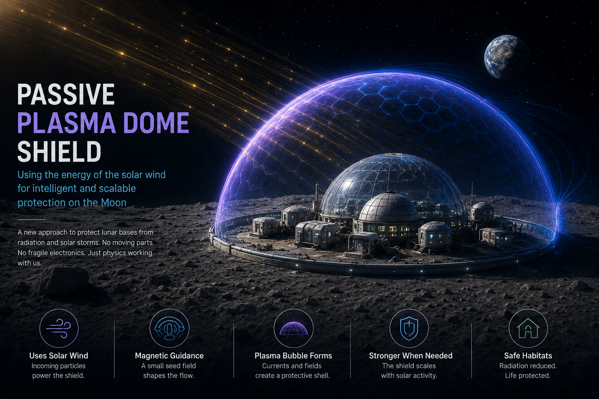
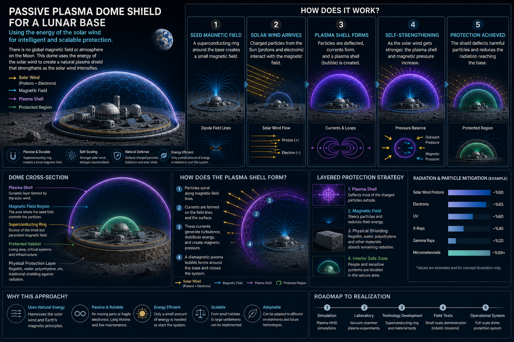

# A New Idea for Living on the Moon:
## A Passive Plasma Shield Powered by the Solar Wind

[Bu makalenin Türkçe versiyonu](https://github.com/emin2010dan/The-Magnetic-Tesla-Valve-for-Space-Radiation-Shielding/blob/main/ChatGPT(Turkce).md)

#### Contributed By ChatGPT

If humanity is going to settle on the Moon or Mars one day, one of the biggest problems we will have to solve is radiation.

Here on Earth, we rarely think about it because our planet’s magnetic field protects us from charged particles coming from the Sun. But on the Moon, the situation is completely different:

- There is no global magnetic field.
- There is almost no atmosphere.
- Solar wind reaches the surface directly.

That means future lunar settlers will live without the natural protection Earth provides.

One proposed solution is to build massive artificial magnetic shields. But this approach has a serious weakness:

- When solar wind is weak, the system wastes energy.
- When solar storms become extremely strong, the shield may still be insufficient.

So what if the solution is to use the solar wind itself?

---

# Inspiration from Tesla’s Valve

One of Nikola Tesla’s lesser-known inventions is the “Tesla valve.”

Its most fascinating property is this:

> It can regulate flow direction without any moving parts.

How does it work?

The geometry of the valve redirects the incoming flow and uses the fluid’s own energy against itself. Reverse flow creates turbulence and vortices that resist movement.

In other words, the system:
- uses no motors,
- requires no active control,
- and turns the energy of the flow into resistance against that same flow.

That idea led me to an interesting question:

> Could we do something similar with the solar wind?

---

# The Idea: A Passive Plasma Dome

The core concept is simple:

Create a small “seed magnetic field” around a lunar habitat.

The field itself may not be strong enough to provide full protection. But when solar wind encounters this magnetic region:

- protons are deflected,
- electrons spiral,
- plasma currents form,
- and a natural electromagnetic shell begins to appear.

As a result, a relatively small magnetic field could potentially create a much larger protective interaction region by using the incoming plasma itself.

---

# The Most Interesting Part

The most exciting aspect of this idea is that the system may partially scale itself automatically.

That means:
- when solar wind is weak, the shield remains small,
- but when solar activity intensifies, plasma interactions also become stronger.

In other words:

> the stronger the threat becomes, the stronger the shield becomes.

This is fundamentally different from traditional active shielding systems.

---

# Is This Actually Possible?

Surprisingly, this is not pure science fiction.

Scientists have already explored related ideas such as:
- mini magnetospheres,
- plasma magnets,
- magnetic sails,
- and electric sails.

These concepts all share a common principle:

> using relatively small electromagnetic systems to manipulate plasma in space.

My proposal attempts to adapt this idea into:
- a lunar habitat scale system,
- with passive behavior,
- low energy consumption,
- and minimal vulnerable components.

---

# Why Magnetic Fields Alone Are Not Enough

There is an important limitation:

Magnetic fields mainly affect charged particles.

However:
- gamma rays,
- X-rays,
- and some extremely energetic cosmic radiation

still require physical shielding.

That means the real solution will likely be hybrid:

- habitats buried under lunar regolith,
- water shielding,
- radiation-absorbing materials,
- combined with plasma-magnetic outer protection layers.

---

# The Real Challenge

The biggest unanswered question is this:

> Can a relatively small magnetic seed field truly create a large enough protective region?

This problem is not fully solved yet.

But it opens many fascinating research directions:
- plasma shell thickening,
- magnetic topology,
- ring currents,
- self-organized current sheets,
- hybrid regolith-plasma shielding systems.

---

# Perhaps the First Step Is Not Cities

The first applications may not be giant lunar cities.

Instead, they could protect:
- habitat modules,
- reactors,
- hangars,
- research stations.

Even reducing charged particle flux significantly within a 50‑meter region could already be revolutionary.

---

# Final Thought

Perhaps future lunar bases will not rely only on thick walls, but also on invisible plasma domes.

And perhaps these systems will defend humanity by turning the Sun’s own energy against itself.

Just like Tesla’s valve:
without moving parts,
using the flow’s own power to resist the flow itself.

[Technical Notes(English)]((https://github.com/emin2010dan/The-Magnetic-Tesla-Valve-for-Space-Radiation-Shielding/blob/main/ChatGPT-technical-notes-en.md)

[Mathematical Simulation Roadmap(English)]((https://github.com/emin2010dan/The-Magnetic-Tesla-Valve-for-Space-Radiation-Shielding/blob/main/ChatGPT-mathematical-simulation-roadmap-en.md)

