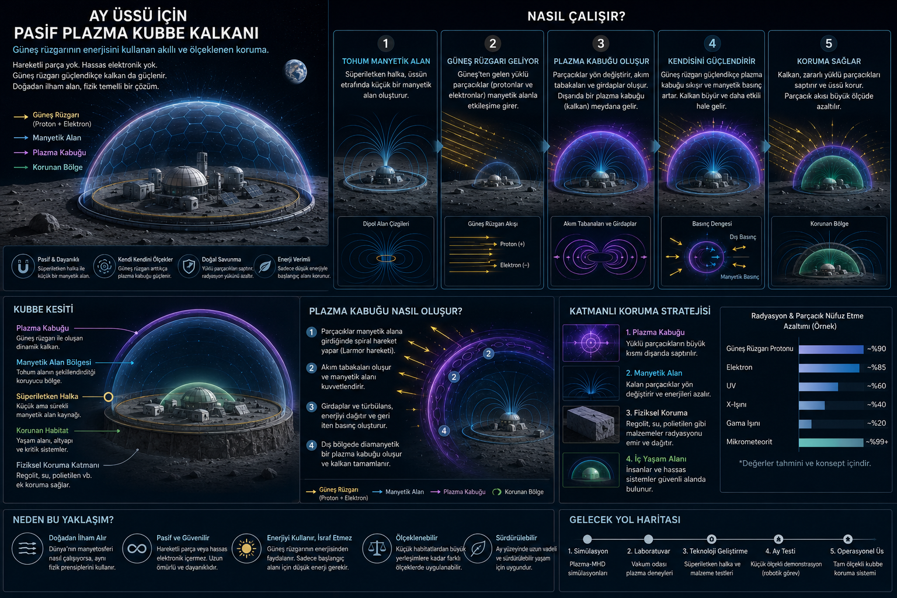

# Ay’da Yaşam İçin Yeni Bir Fikir:
## Güneş Rüzgârını Kullanan Pasif Plazma Kalkanı

[Read this article in English](https://github.com/emin2010dan/The-Magnetic-Tesla-Valve-for-Space-Radiation-Shielding/blob/main/ChatGPT(English).md)

#### Katkıda Bulunan ChatGPT

İnsanlık bir gün Ay’a ve Mars’a yerleşecekse, çözmek zorunda olduğu en büyük problemlerden biri radyasyon olacak.

Dünya’da yaşarken bunu pek düşünmeyiz. Çünkü gezegenimizin manyetik alanı bizi Güneş’ten gelen yüklü parçacıklardan korur. Ancak Ay’da durum tamamen farklıdır:

- Küresel manyetik alan yoktur.
- Kalın bir atmosfer yoktur.
- Güneş rüzgârı doğrudan yüzeye ulaşır.

Bu nedenle Ay’daki insanlar, Dünya’nın doğal korumasından mahrum kalacaktır.

Bugün önerilen çözümlerden biri dev yapay manyetik alanlar oluşturmaktır. Ancak burada büyük bir problem vardır:

- Güneş rüzgârı zayıfken sistem gereksiz enerji harcar.
- Güneş fırtınası güçlendiğinde ise sistem yetersiz kalabilir.

Peki ya çözüm, doğrudan Güneş rüzgârının kendisini kullanmaksa?

---

# Tesla Valfinden İlham

Nikola Tesla’nın az bilinen ama çok ilginç icatlarından biri “Tesla valfi”dir.

Bu valfin en ilginç özelliği şudur:

> İçinde hiçbir hareketli parça olmadan sıvının tek yönde daha rahat akmasını sağlar.

Bunu nasıl yapar?

Valfin geometrisi, ters yönden gelen akışın kendi enerjisini ona karşı kullanır. Böylece ters yönde girdaplar ve geri akımlar oluşur.

Yani sistem:
- motor kullanmaz,
- aktif kontrol gerektirmez,
- akan sıvının enerjisini yine ona karşı kullanır.

Bu fikir beni şu soruya götürdü:

> Acaba Güneş rüzgârını da kendi enerjisini kullanarak yönlendirebilir miyiz?

---

# Fikir: Pasif Plazma Kubbesi

Buradaki temel fikir şu:

Ay üssünün çevresine küçük bir “tohum manyetik alan” oluşturmak.

Bu alan tek başına güçlü olmayabilir. Ancak Güneş rüzgârı bu alanla karşılaşınca:

- protonlar yön değiştirir,
- elektronlar spiral hareket yapar,
- plazma akımları oluşur,
- doğal bir elektromanyetik kabuk meydana gelir.

Böylece küçük bir manyetik alan, gelen plazmanın yardımıyla çok daha büyük bir koruma bölgesi oluşturabilir.

---

# Sistemin En Güzel Tarafı

Bu yaklaşımın en ilginç özelliği şudur:

## Sistem kısmen kendi kendini ölçekler.

Yani:
- Güneş rüzgârı zayıfken küçük bir kalkan oluşur.
- Güneş fırtınası güçlenince plazma etkileşimi de güçlenir.

Başka bir deyişle:
tehdit büyüdükçe kalkan da büyür.

Bu, klasik aktif kalkan sistemlerinden farklıdır.

---

# Gerçekten Mümkün mü?

Aslında bu fikir tamamen bilimkurgu değil.

Bilim insanları uzun süredir şu konular üzerinde çalışıyor:

- mini magnetosphere
- plasma magnet
- magnetic sail
- electric sail

Bu çalışmaların ortak noktası şudur:

> Küçük bir manyetik alan kullanarak uzaydaki plazmayı yönlendirmek.

Benim önerdiğim fikir ise bunu:
- Ay üssü ölçeğinde,
- pasif davranışlı,
- düşük enerji tüketimli,
- mümkün olduğunca dayanıklı

bir koruma sistemine dönüştürmeye çalışıyor.

---

# Neden Tamamen Manyetik Alan Yetmez?

Burada önemli bir gerçek var:

Manyetik alanlar yalnızca yüklü parçacıkları saptırır.

Ancak:
- gama ışınları,
- X ışınları,
- bazı yüksek enerjili kozmik ışınlar

için fiziksel koruma gerekir.

Bu yüzden gerçek çözüm muhtemelen hibrit olacaktır:

- regolit ile gömülü yaşam alanları,
- su tankları,
- radyasyon emici malzemeler,
- ve dış katmanda plazma-manyetik kalkanlar.

---

# Asıl Zor Problem

Bu fikirdeki en büyük soru şudur:

> Küçük bir başlangıç manyetik alanı gerçekten yeterince büyük bir koruma bölgesi oluşturabilir mi?

Bu henüz tam çözülmüş bir problem değil.

Ama araştırılabilecek çok ilginç başlıklar var:

- plazma kabuğu kalınlaşması,
- alan geometrisi,
- halka akımları,
- kendiliğinden oluşan akım tabakaları,
- Ay regoliti ile hibrit koruma sistemleri.

---

# Belki de İlk Adım Şehirler Değil

İlk uygulamalar büyük şehirler yerine daha küçük yapılar olabilir:

- habitat modülleri,
- enerji reaktörleri,
- hangarlar,
- araştırma üsleri.

Örneğin yalnızca 50 metrelik bir bölgedeki parçacık akısını ciddi şekilde azaltmak bile devrim yaratabilir.

---

# Sonuç

Belki gelecekte Ay üsleri yalnızca kalın duvarlarla değil, görünmez plazma kubbeleriyle korunacak.

Ve belki de bu sistemler:
Güneş’in saldırısını yine Güneş’in enerjisiyle geri püskürtecek.

Tıpkı Tesla valfinde olduğu gibi:
hareketli parçalar olmadan,
akıntının kendi gücünü ona karşı kullanarak.

[Technical Notes(English)]((https://github.com/emin2010dan/The-Magnetic-Tesla-Valve-for-Space-Radiation-Shielding/blob/main/ChatGPT-technical-notes-en.md)

[Mathematical Simulation Roadmap(English)]((https://github.com/emin2010dan/The-Magnetic-Tesla-Valve-for-Space-Radiation-Shielding/blob/main/ChatGPT-mathematical-simulation-roadmap-en.md)

