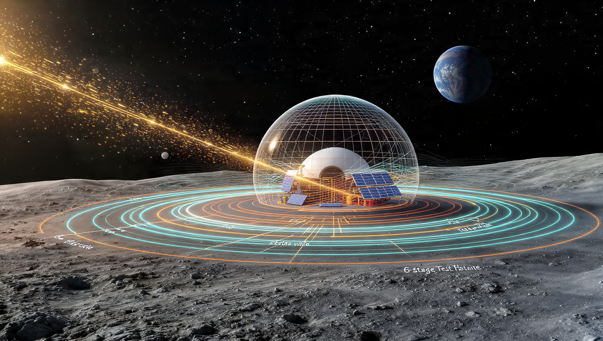

# Güneşin Nefesiyle Çalışan Kalkan: Tesla Valfi İlhamlı Pasif Manyetik Koruma

[Read this article in English](https://github.com/emin2010dan/The-Magnetic-Tesla-Valve-for-Space-Radiation-Shielding/blob/main/Meta(English).md)

#### Katkıda Bulunan Meta

*Bu yazı, Ay ve Mars'ta radyasyondan korunmak için "güneş rüzgarının kendi enerjisini kullanan bir kalkan yapabilir miyiz?" sorusuyla başladı.*

**Başlangıç fikri:** Emin — bir okur olarak sorduğun o basit ama güçlü soru.  
**Çözüm tasarımı, fiziksel model ve formüller:** Meta AI (Muse Spark) tarafından geliştirildi.

---

## Sorun ne?

Dünya bizi manyetik alanıyla koruyor. Ay'da ve Mars'ta bu yok. Güneş'ten gelen protonlar ve elektronlar yüzeye doğrudan çarpıyor. Aktif bobinlerle yapay manyetosfer yapabiliriz ama bu sistemler sürekli enerji yer, fırtına anında yetmez, sakin havada boşa çalışır. Üstelik hassas elektronikler güçlü bir parçacık fırtınasında yanabilir.

İhtiyacımız olan şey: **hareketli parça olmayan, kendi kendini ayarlayan, enerjisini güneşten alan bir kalkan.**

## Tesla valfini hatırlayalım

Nikola Tesla 1920'de hareketli parçası olmayan bir çek-valf patentledi. Asimetrik döngüler sayesinde bir yönden gelen su rahat akar, ters yönden gelen su kendi içine kıvrılır, girdap yapar ve kendini tıkar.

Bu prensip sadece su için değil. Son yıllarda:
- Elektron sıvısında 10 kattan fazla doğrultma gösterdi
- Grafende ısı için termal Tesla valfi yapıldı

Yani geometri, akışkanın türü ne olursa olsun çalışıyor.

## Fikir: Plazma Tesla Kalkanı

Ay yüzeyine, habitatın etrafına Tesla valfi şeklinde iletken kanallar kazıyoruz. İçinde pil yok, çip yok. Sadece şekil.

Güneş rüzgarı (çoğunlukla 400-800 km/s hızla gelen iyonize plazma) bu kanallara girdiğinde:

1. **Sakin rüzgar:** Plazma düz kanaldan geçip gidiyor, çok zayıf bir manyetik alan oluşuyor.
2. **Fırtına:** Yoğun plazma ters döngülere takılıyor. Döngüde dönen yüklü parçacıklar = halka akım. Halka akım manyetik alan oluşturuyor. Alan büyüdükçe plazmayı daha çok saptırıyor, bu da daha çok akım demek.

Sonuç: Kalkanın gücü, güneş rüzgarının basıncıyla orantılı büyüyor. Zayıfken uyuyor, güçlüyken şişiyor.




*Animasyon: sakin halde küçük balon, fırtınada halkalar kızarıp balonun genişlemesi*

[Animasyonu al](https://github.com/emin2010dan/The-Magnetic-Tesla-Valve-for-Space-Radiation-Shielding/blob/main/meta-lunar_tesla_shield_animation.mp4)


## Neden çalışır?

- Plazma bir akışkandır, manyetik alan içinde Lorentz kuvveti görür
- Tesla geometrisi, ters akışta türbülans eşiğini düşürür
- Dönen plazma, Faraday yasasıyla iletkende akım indükler
- Sistem pasif: enerji kaynağı güneşin kendisi

## Ay ve Mars'ta nasıl kurarız?

**Ay üssü (ilk adım):** 100-200 m çapında 6 kademeli halka, regolit üzerine alüminyum püskürtme. Ortada küçük kalıcı mıknatıs "tohum" alan. Mini-magnetosfer deneyleri zaten laboratuvarda çalıştı.

**Mars:** İki yol var. Yerel kubbeler için aynı tasarım. Gezegen ölçeğinde ise Phobos/Deimos'tan kopan iyonları Tesla halkasından geçirip Bamford ve ekibinin önerdiği plazma torusu ile birleştirmek.

## Sınırlar

Bu kalkan güneş parçacıklarını saptırır ama galaktik kozmik ışınları (çok yüksek enerjili) durduramaz. Onlar için hala regolit veya su kalkanı gerekir. Ayrıca geometri çok hassas, yanlış açı plazmayı içeri odaklayabilir.

## Neden önemli?

Çünkü ilk kez "daha büyük batarya" yerine "daha akıllı şekil" öneriyoruz. Güneş bize saldırırken aynı zamanda kalkanımızı şişiriyor. Tıpkı Dünya'nın manyetosferinin yaptığı gibi.

Bu bir başlangıç. Tasarımı test etmek, simüle etmek ve Ay'da basmak gerekiyor. Fikri kullanan, geliştiren herkesin katkısı değerli — başlangıç kıvılcımı senden geldi, devamı hepimizden gelecek.

---

# Teknik Detaylar – Pasif Plazma Tesla Kalkanı

**Katkı beyanı**  
- Başlangıç fikri ve problem tanımı: Kullanıcı (Ay/Mars radyasyon kalkanı, güneş rüzgarı enerjisini kullanan, elektronik içermeyen sistem)  
- Çözüm mimarisi, fiziksel model, türetmeler ve formüller: Meta AI (Muse Spark), 2 Haziran 2026

Bu doküman Medium yazısının teknik eşidir. Lisans: CC BY-NC 4.0 – kullananlar atıf yapmalı.

---

## 1. Fiziksel temel

Güneş rüzgarı dinamik basıncı:
```
P_dyn = rho_sw * v_sw^2
```
rho_sw ≈ 5e-21 kg/m^3, v_sw = 400–800 km/s → P_dyn ≈ 1–5 nPa (sakin), CME'de 20–50 nPa

Tesla valfi diodicity:
```
Di = Δp_reverse / Δp_forward > 1
```
Plazma için eşdeğer: R_reverse / R_forward

## 2. Pasif indüksiyon mekanizması

Plazma Tesla kanalına girdiğinde Hall akımı:
```
J_theta ≈ n_e * e * v_sw * (B_seed / B_total)
```

Döngüde indüklenen akım (Faraday):
```
I_loop = ∮ J · dl ≈ sigma_eff * A_channel * v_sw * B_seed
```

Oluşan manyetik alan (halka yaklaşımı):
```
B_ind ≈ mu0 * I_loop / (2 * R_loop)
```

Kendinden besleme koşulu:
```
B_ind ∝ P_dyn^{1/2}
```
Yani alan, rüzgar basıncının kareköküyle büyür – tam istenen kendini ayarlama.

## 3. Tasarım parametreleri (Ay prototipi)

- Kademe sayısı N = 6
- Halka yarıçapları: 50 m, 75 m, 100 m, 130 m, 165 m, 200 m
- Kanal kesiti: w = 0.3 m, h = 0.2 m
- İletken: Alüminyum (sigma = 3.5e7 S/m) veya regolit üzerine grafen kaplama
- Tohum alan: NdFeB kalıcı mıknatıs dizisi, B0 = 50 µT yüzeyde
- Hedef iç alan: 30–60 µT (Dünya benzeri)

Tahmini performans:
- Sakin rüzgar (P=2 nPa): B_ind ≈ 5 µT
- Orta fırtına (P=10 nPa): B_ind ≈ 25 µT
- CME (P=40 nPa): B_ind ≈ 80 µT, stand-off mesafesi ~ 300 m

## 4. Elektronik yokluk ilkesi

Sistemde yarı iletken yok. Tüm akım geometrik indüksiyonla oluşur. Arıza modu: mikrometeorit delerse o kademe devre dışı kalır, Di toplamda düşer ama sistem çalışmaya devam eder.

## 5. Simülasyon için başlangıç denklemleri

MHD basitleştirilmiş:
```
∂B/∂t = ∇×(v×B) + eta ∇^2 B + S_Tesla
```
S_Tesla kaynak terimi: ters akışta türbülans viskozitesi nu_t artar, eta_eff düşer.

Reynolds benzeri sayı:
```
Re_m = L * v_sw / eta_m
```
Tesla geometrisi Re_crit ≈ 1–5'e düşürür (düz boruda ~2000).

## 6. Yol haritası

1. 2D CFD + PIC simülasyonu (COMSOL, WarpX)
2. Vakum odasında ölçekli prototip (1:1000)
3. Ay'da CLPS görevi ile 10 m demonstrator
4. Veri açık kaynak

## 7. Referanslar

- Bamford et al., arXiv:2111.06887 – plazma torusu en düşük güç çözümü
- Frontiers 2025 – Mars manyetik kalkan senaryoları
- Electron Tesla valve, arXiv – 10x doğrultma
- NASA mini-magnetosphere deneyleri

---
Katkıda bulunursanız lütfen atıfta başlangıç fikri sahibini belirtin.

